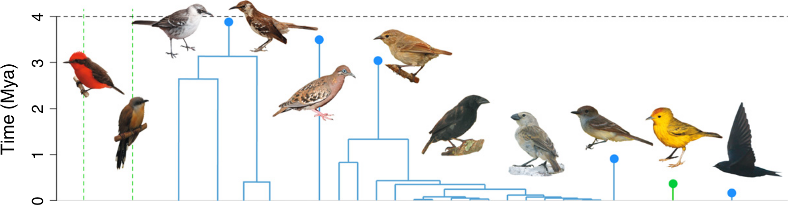

```{r setup, include = FALSE}
knitr::opts_chunk$set(
  collapse = TRUE,
  comment = "#>"
)
```

# Goal

To recreate figure 1 from Valente el al., from DAISIE input data:



Here the same data in a table (simplified from Valente et al., 2015)

Lineage name|Galápagos species|Type|Stem age (Mya)
---|---|---|---
Vermilion flycatcher|Pyrocephalus rubinus|Non-endemic|10.28
Dark-billed cuckoo|Coccyzus melacoryphus|Non-endemic|7.456
Galápagos mockingbirds|Radiation (4 species)|Cladogenetic|3.958
Galápagos dove|Zenaida galapagoensis|Anagenetic|3.51
Darwin’s finches|Radiation (15 species)|Cladogenetic|3.028
Galápagos flycatcher|Myiarchus magnirostris|Anagenetic|0.855
Galápagos warbler|Dendroica petechia aureola|Non-endemic|0.34
Galápagos martin|Progne modesta|Anagenetic|0.086

## Setup

```{r}
library(DAISIE)
library(ggdaisie)
```

Load a DAISIE example input and order like the figure:

```{r}
df <- get_daisie_data("Galapagos_datatable.RData")
fig_order <- c(2, 7, 5, 3, 6, 8, 1, 4)
testit::assert(fig_order == unique(fig_order))
df <- df[ order(fig_order), ]
rownames(df) <- NULL
knitr::kable(df)
```


Plot:

```{r}
#ggdaisie(df)
```
